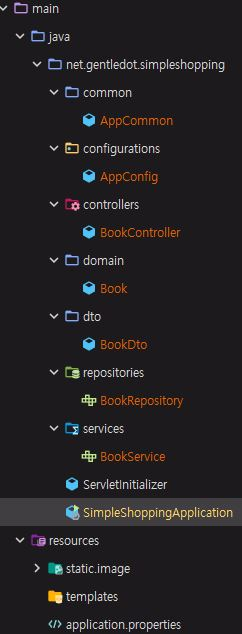

# 도서 쇼핑몰 (simple-shopping)
도서 [자바 웹을 다루는 기술 (2쇄)] - 2019.08.20, 이병승, 길벗출판사  

- 위 도서의 31장의 실습 자료를 resource로 사용하여 Spring Boot로 Web page를 구성.
- 적용한 내용은 [SimpleShopping](https://www.notion.so/gentledot/simple-shopping-179fe46cbcec419aba1d7dcc0fe3d285) 에 정리.

## 목표
1. Spring MVC 학습 및 내용 정리.
1. Spring Data JPA 사용 정리. (mySQL 사용 / test 시에는 embedded DB인 H2 사용)
1. Junit 5를 활용한 단위 / 통합 테스트 정리 / TDD 개발 방법 적응.
1. Spring Security를 이용한 Login 기능 구현.
1. RESTful Web App 구성.
1. View page를 구현하며 thymeleaf에 친숙해지기.
1. Gradle 6 version 사용 방법에 친숙해지기. (optional)
1. Java 8 이상 내용 정리. (optional)
1. git 활용에 익숙해지기. (optional)

## 참고자료
- 도서
    - 자바 웹을 다루는 기술 (2쇄) - 2019.08.20, 이병승, 길벗출판사
    - 모던 자바 인 액션 - 2019.08.01, 라울-게이브리얼 우르마, 마리오 푸스코, 옐런 마이크로프트 (옮긴이 : 우정은, 펴낸이 : 김태현), 한빛미디어
    
## 환경
- IDE
    - IntelliJ IDEA 2019.3 (Ultimate Edition)

- JDK
    - Java 11 (11.0.5)

- Framework
    - Spring Boot 2.2.2
    - Dependency
        - Gradle 6.0.1

- dependencies (필요할 때마다 추가할 예정)
    - implementation 'org.springframework.boot:spring-boot-starter-data-jpa'
    - implementation 'org.springframework.boot:spring-boot-starter-thymeleaf'
    - implementation 'org.springframework.boot:spring-boot-starter-web'
    - implementation 'com.h2database:h2'
    - compileOnly 'org.projectlombok:lombok'
    - developmentOnly 'org.springframework.boot:spring-boot-devtools'
    - annotationProcessor 'org.projectlombok:lombok'
    - providedRuntime 'org.springframework.boot:spring-boot-starter-tomcat'
    - testImplementation('org.springframework.boot:spring-boot-starter-test'


## 구현 기능 정리

| 기능 | 세부기능 |
| :--- | --- |
| 메인페이지    | 메인페이지         |
|               | 빠른 메뉴          |
| 회원 기능     | 로그인             |
|               | 회원가입           |
| 상품 기능     | 상품 검색          |
| 장바구니 기능 | 장바구니 상품 조회 |
|               | 장바구니 상품 추가 |
|               | 장바구니 상품 수정 |
|               | 장바구니 상품 삭제 |
| 주문 기능     | 상품 주문          |
|               | 주문 상품 조회     |
|               | 주문 수정          |
|               | 주문 취소          |
| MyPage 기능   | 주문 내역 조회     |
|               | 회원 정보 수정     |
|               | 회원 탈퇴          |
                  

## 개발 내용 정리

### 프로젝트 최초 생성
- 원칙
    - checkpoint로 git stash 사용
    - 기능별로 branch 생성
    - 기본적으로 test가 fail 되지 않은 상태에서 commit을 한다.
    - commit 전에는 readme.md 업데이트 진행
    - 자세한 정리는 http://bit.ly/gentledot 에 추가
    
- 책 정보 출력을 위한 패키지 구조 설정  
   
   
   - MVC 구조 설정 (Model - View - Controller)
        - model과 Dto (Data Transaction Object) 분리
        - configuration, common 추가
   
   - static > image 폴더 내 예제에 사용된 이미지를 가져왔음.
    

### 책 정보 구성
- 책은 다음의 정보를 가지고 있다고 설정
    - 책 id
    - 책 제목
    - 책 설명 (간략한)
    - 분류
    - 상태
    - 발행일
    - 가격
    
    ```
    public class Book {
        @EqualsAndHashCode.Include
        private Long bookId;
        private String title;
        private String description;
        private BookCategory category;
        private BookStatus status;
        private LocalDateTime publishDate;
        private Integer price;
    }
    ```
- 책 분류는 4가지가 있다고 설정하였음. 
    - DRAMA, HUMOR, TEXTBOOK, ESSAY
    
- 상태는 예제에서 분류한 신간, 베스트셀러, 스테디셀러로 구분
    - NEW, BESTSELLER, STEADYSELLER

- 책 정보와 같이 출력될 이미지는 책 이미지 정보 entity를 추가 생성하여 설정
    - 이미지 id
    - 책 id
    - 이미지 명
    - 이미지 주소
      
    ```
    public class BookImage {
        private Long imageId;
        private Long bookId;
        private String name;
        private String address;
    }
    ```
